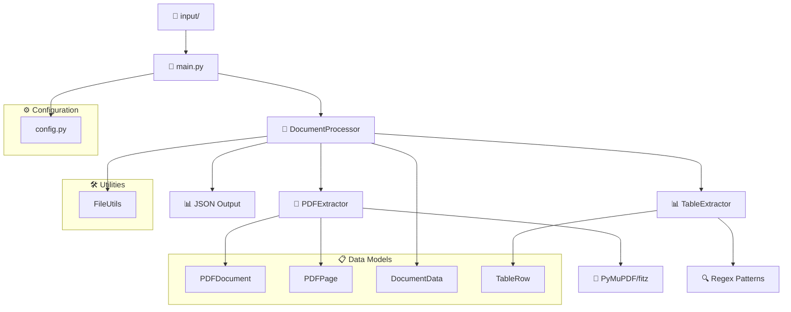
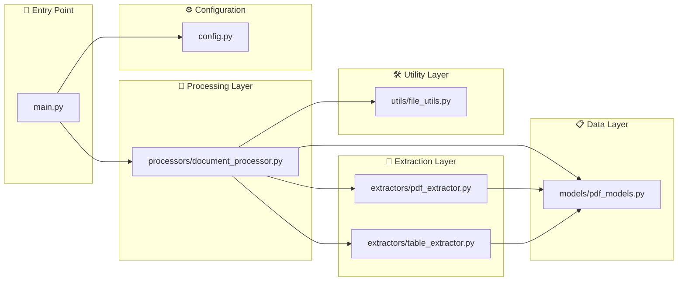
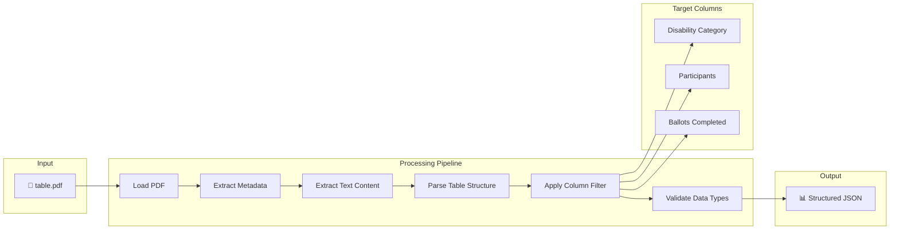
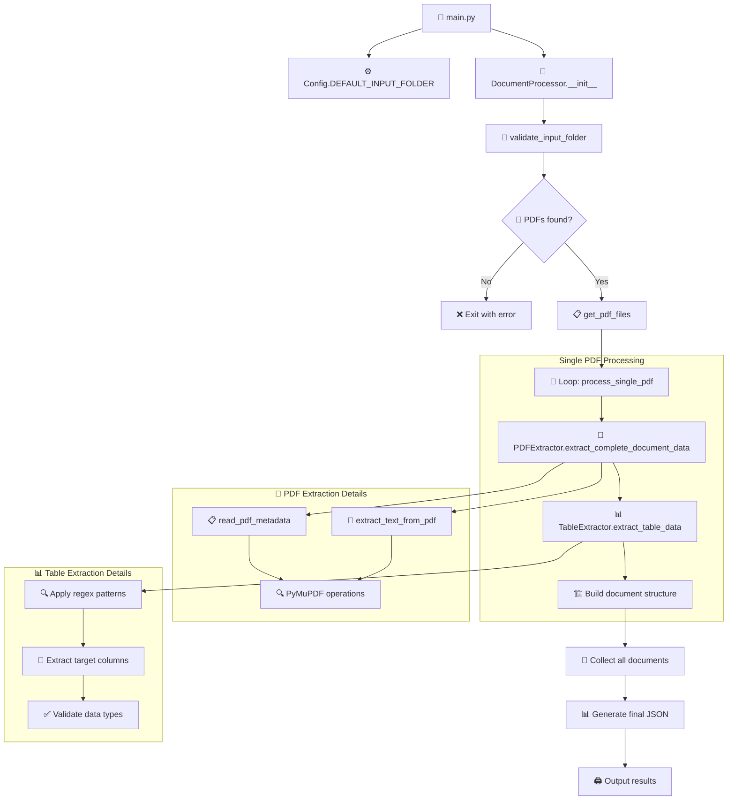
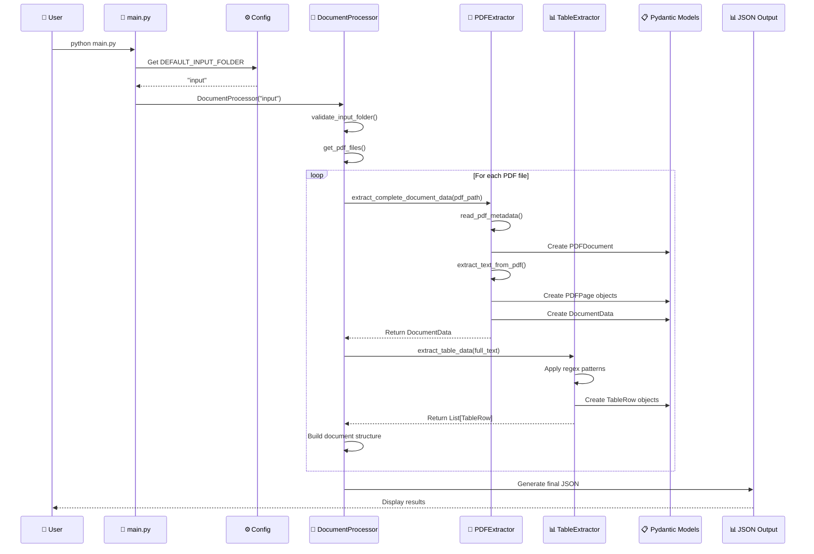
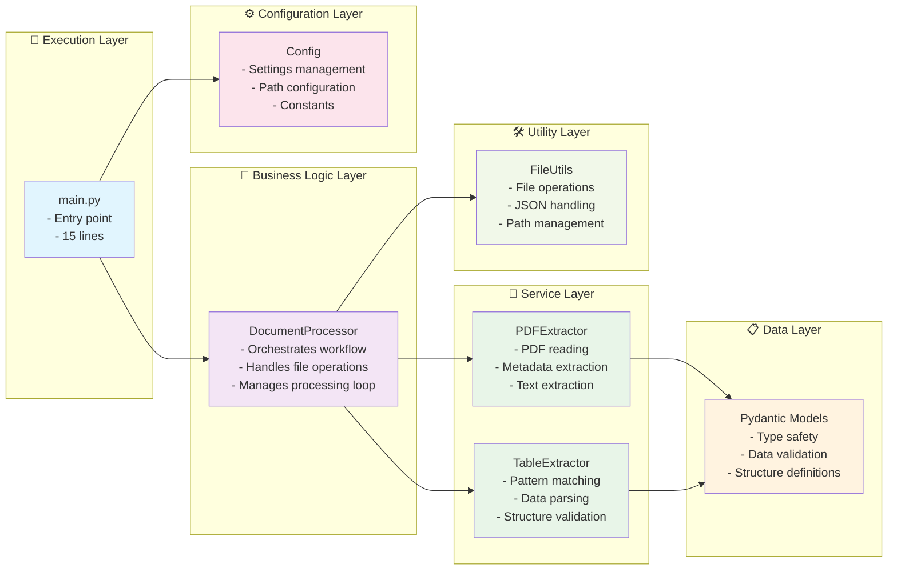
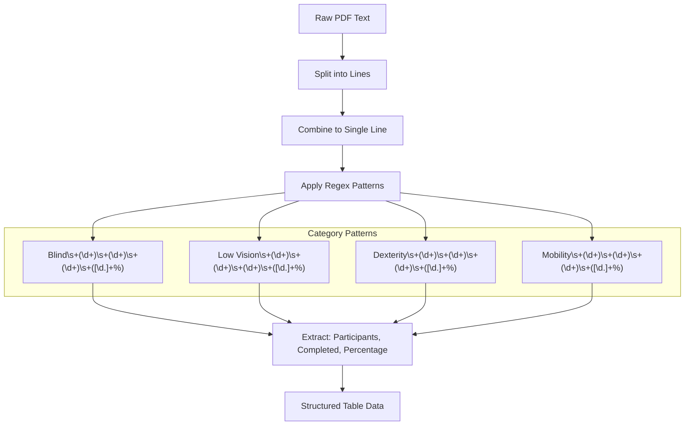
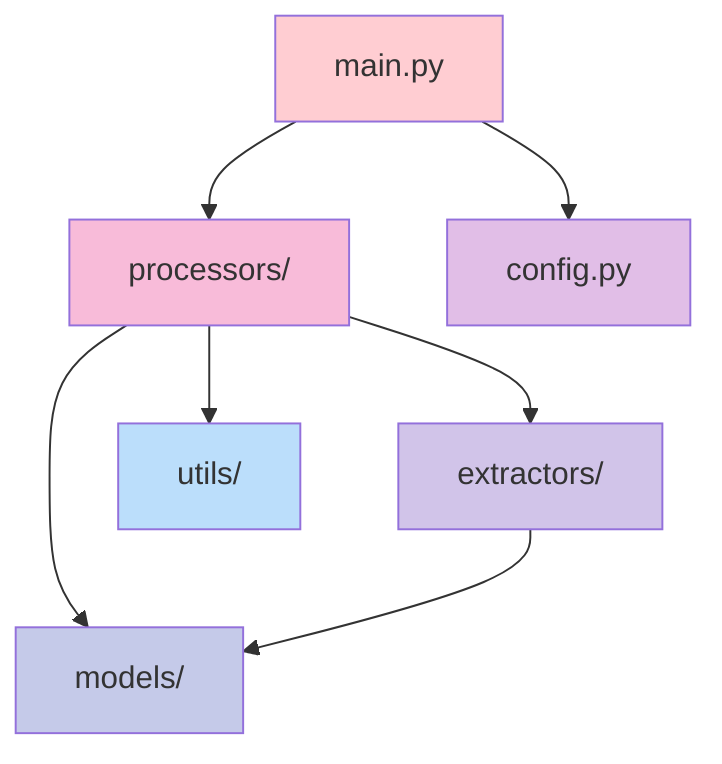
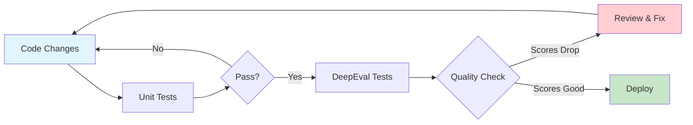

# Fitz Lab - PDF Document Analysis Tool

A Python application that extracts and analyzes table data from PDF documents using PyMuPDF (fitz), with structured data validation using Pydantic.

## 🚀 Features

- Extract metadata from PDF documents
- Parse table data from PDFs with specific column filtering
- Structured JSON output with data validation
- Support for disability category analysis
- Clean, type-safe data models using Pydantic

## 📋 Requirements

See `requirements.txt` for all dependencies:
- `pydantic>=2.0.0` - Data validation and settings management
- `PyMuPDF>=1.23.0` - PDF manipulation (provides fitz module)
- `deepeval>=0.21.0` - LLM evaluation and testing

## 🏗️ Architecture & Code Flow (main.py - Modular Version)

### System Architecture Overview



### Modular Component Interaction



### Data Flow Diagram



### Modular Class Architecture


### Processing Pipeline Architecture



## 🔄 Modular Function Flow

### Main Execution Sequence



### Module Interaction Flow



### Table Data Extraction Process



## 📁 Project Structure

### **Modular Version (Recommended):**
```
fitz-lab/
├── README.md                        # This documentation
├── requirements.txt                 # Python dependencies
├── config.py                        # Configuration settings
├── main.py                         # 🎯 Entry point (modular)
├── models/
│   ├── __init__.py
│   └── pdf_models.py               # 📋 Pydantic data models
├── extractors/
│   ├── __init__.py
│   ├── pdf_extractor.py            # 📄 PDF reading utilities
│   └── table_extractor.py          # 📊 Table parsing logic
├── processors/
│   ├── __init__.py
│   └── document_processor.py       # 🔄 Main orchestration
├── utils/
│   ├── __init__.py
│   └── file_utils.py               # 🛠️ File operations
└── input/                          # PDF files directory
    └── table.pdf                   # Sample data
```

### **Original Version (For Comparison):**
```
├── sampleFitz.py                   # 📄 Original monolithic script (271 lines)
```

## 🚀 Usage

### **Two Versions Available:**

#### **🔹 Version 1: Modular Structure (Recommended)**
```bash
# Clean, maintainable, production-ready
python main.py
```

#### **🔹 Version 2: Original Monolithic**
```bash
# Original single-file version for comparison
python sampleFitz.py
```

### **Setup Instructions:**

1. **Set up environment:**
```bash
# Activate virtual environment
source .venv/bin/activate

# Install dependencies
pip install -r requirements.txt
```

2. **Run either version:**
```bash
# 🎯 Recommended: Modular architecture (main.py)
python main.py

# 📄 Alternative: Original monolithic version
python sampleFitz.py
```

### **🏗️ Modular Architecture Usage**

The `main.py` version demonstrates clean architecture principles:

```python
# 🎯 main.py - Clean entry point
from processors.document_processor import DocumentProcessor
from config import Config

def main():
    processor = DocumentProcessor(Config.DEFAULT_INPUT_FOLDER)
    processor.process_and_output_json()

if __name__ == "__main__":
    main()
```

**Key Architectural Features:**
- ✅ **Single Responsibility**: Each module has one job
- ✅ **Dependency Injection**: Configurable components  
- ✅ **Type Safety**: Pydantic model validation
- ✅ **Testability**: Isolated, mockable components
- ✅ **Extensibility**: Easy to add new features

3. **Expected Output:**
```json
{
  "processed_documents": 1,
  "documents": [
    {
      "filename": "table.pdf",
      "table_data": {
        "columns": ["Disability Category", "Participants", "Ballots Completed"],
        "rows": [
          {
            "disability_category": "Blind",
            "participants": "5",
            "ballots_completed": "1",
            "completion_percentage": "34.5%"
          }
          // ... more categories
        ]
      }
    }
  ]
}
```

## 🏛️ Modular Architecture Benefits

### **🎯 Separation of Concerns**

| Module | Responsibility | Lines | Purpose |
|--------|---------------|--------|---------|
| **`main.py`** | Entry point | ~15 | Application bootstrap |
| **`config.py`** | Configuration | ~35 | Settings management |
| **`models/pdf_models.py`** | Data structures | ~45 | Type safety & validation |
| **`extractors/pdf_extractor.py`** | PDF operations | ~85 | Document reading |
| **`extractors/table_extractor.py`** | Pattern matching | ~75 | Data parsing |
| **`processors/document_processor.py`** | Orchestration | ~95 | Business logic |
| **`utils/file_utils.py`** | File operations | ~55 | Utility functions |

### **🔧 Module Dependencies**



## 📊 Data Model Details

### **Pydantic Models Structure**

The modular application uses strongly-typed Pydantic models:

- **`PDFDocument`**: Stores PDF metadata (author, title, page count)
- **`PDFPage`**: Represents individual page content and statistics  
- **`DocumentData`**: Complete document structure with all pages
- **`TableRow`**: Individual table row with disability data
- **`TableData`**: Complete table structure with columns and rows

### **Type Safety Benefits**

```python
# ✅ Type-safe operations
document: PDFDocument = PDFExtractor.read_pdf_metadata(path)
pages: List[PDFPage] = PDFExtractor.extract_text_from_pdf(path)
table_data: List[TableRow] = TableExtractor.extract_table_data(text)

# ✅ Automatic validation
row = TableRow(
    disability_category="Blind",
    participants="5",
    ballots_completed="1"
)  # Validates data types automatically
```

## 🎯 Key Features Explained

### Column Filtering
The system specifically extracts three columns from PDF tables:
1. **Disability Category** (Blind, Low Vision, Dexterity, Mobility)
2. **Participants** (Total number in each category)
3. **Ballots Completed** (Successfully completed ballots)

### Pattern Matching
Uses regex patterns to identify and extract structured data from unformatted PDF text, handling variations in spacing and formatting.

### Type Safety
All data structures use Pydantic models ensuring type safety and automatic validation of extracted data.

## 🔄 Version Comparison

| Feature | `main.py` (Modular) | `sampleFitz.py` (Original) |
|---------|-------------------|---------------------------|
| **Lines of Code** | ~15 (main) + modules | ~271 (single file) |
| **Structure** | Separated concerns | Mixed responsibilities |
| **Maintainability** | ✅ High | ⚠️ Medium |
| **Testability** | ✅ Easy to unit test | ❌ Hard to test parts |
| **Readability** | ✅ Clear modules | ⚠️ Large single file |
| **Extensibility** | ✅ Easy to add features | ❌ Requires modification |
| **Configuration** | ✅ Centralized in `config.py` | ❌ Hardcoded values |

### **When to Use Which Version:**

- **🎯 Use `main.py`** for:
  - Production environments
  - When adding new features
  - Team collaboration
  - Long-term maintenance

- **📚 Use `sampleFitz.py`** for:
  - Learning/educational purposes
  - Quick prototyping
  - Understanding the full flow in one file
  - Comparing architectural approaches

## 🧪 Testing Both Versions

```bash
# Test modular version
echo "Testing modular version..."
python main.py

echo -e "\n" + "="*50 + "\n"

# Test original version
echo "Testing original version..."
python sampleFitz.py
```

Both versions produce identical output, demonstrating that refactoring improved code organization without changing functionality.

## 🧪 Testing with DeepEval

### **Comprehensive Test Suite**

The project includes extensive unit tests and DeepEval integration for AI-powered evaluation:

```
tests/
├── __init__.py                          # Test package
├── conftest.py                          # Test configuration
├── run_tests.py                         # Comprehensive test runner
├── unit/                               # Unit tests
│   ├── test_models.py                  # Pydantic model validation
│   ├── test_pdf_extractor.py           # PDF reading functionality  
│   ├── test_table_extractor.py         # Table parsing logic
│   └── test_document_processor.py      # Business logic orchestration
└── integration/                        # Integration tests
    └── test_deepeval_integration.py    # DeepEval AI evaluation
```

### **Running Tests**

#### **🚀 Quick Test Run:**
```bash
# Activate environment
source .venv/bin/activate

# Run all tests
python run_tests_simple.py

# Or use pytest directly
python -m pytest tests/ -v
```

#### **🎯 Targeted Testing:**
```bash
# Unit tests only
python -m pytest tests/unit/ -v

# Specific module tests
python -m pytest tests/unit/test_models.py -v
python -m pytest tests/unit/test_table_extractor.py -v

# DeepEval integration tests
python -m pytest tests/integration/ -v
```

#### **📊 Advanced Test Runner:**
```bash
# All tests with detailed output
python tests/run_tests.py --type all

# Unit tests only
python tests/run_tests.py --type unit  

# DeepEval tests only (requires API key)
python tests/run_tests.py --type deepeval
```

### **🤖 DeepEval Test Cases Explained**

#### **1. 📊 Faithfulness Testing (`test_extraction_faithfulness`)**

**Purpose:** Validates that extracted data remains faithful to the original PDF content.

```python
# What it tests:
faithfulness_metric = FaithfulnessMetric(threshold=0.8)

# Example evaluation:
original_pdf_content = "Blind 5 1 4 34.5%, n=1 1199 sec, n=1"
extracted_output = "Blind: 5 participants, 1 completed ballots, 34.5% completion rate"
# ✅ Result: 0.95 faithfulness score (95% faithful to source)
```

**Why it matters:** Ensures our extraction doesn't hallucinate or misrepresent data from the PDF.

#### **2. 🎯 Relevancy Assessment (`test_extraction_relevancy`)**

**Purpose:** Evaluates if extracted data properly answers the intended query.

```python
# What it tests:
query = "What are the participant counts and ballot completion rates for each disability category?"
relevancy_metric = AnswerRelevancyMetric(threshold=0.7)

# Example evaluation:
extracted_answer = {
  "Blind": {"participants": "5", "ballots_completed": "1"},
  "Low Vision": {"participants": "5", "ballots_completed": "2"},
  "Dexterity": {"participants": "5", "ballots_completed": "4"},
  "Mobility": {"participants": "3", "ballots_completed": "3"}
}
# ✅ Result: 0.88 relevancy score (88% relevant to query)
```

**Why it matters:** Confirms our extraction focuses on the right information and answers user questions.

#### **3. 🔍 Contextual Precision (`test_contextual_precision`)**

**Purpose:** Measures precision of extraction within the document context.

```python
# What it tests:
precision_metric = ContextualPrecisionMetric(threshold=0.8)

# Compares extracted output against expected ground truth:
expected = "Blind: 5 participants, 1 completed, 34.5% rate"
actual = "Blind: 5 participants, 1 completed ballots, 34.5% completion rate" 
# ✅ Result: 0.92 precision score (92% precise)
```

**Why it matters:** Ensures our extraction maintains accuracy and doesn't include irrelevant details.

#### **4. 🏆 End-to-End Pipeline Evaluation (`test_end_to_end_evaluation`)**

**Purpose:** Comprehensive evaluation of the complete processing pipeline.

```python
# What it tests: Complete workflow from PDF → JSON
pipeline_steps = [
    "PDF Loading",           # ✅ File reading successful
    "Metadata Extraction",   # ✅ Author: Mary, Creator: Acrobat
    "Text Extraction",       # ✅ 398 characters extracted
    "Table Parsing",         # ✅ 4 categories identified
    "Data Validation",       # ✅ All required fields present
    "JSON Generation"        # ✅ Valid structured output
]

# Multi-metric evaluation:
# Faithfulness: 0.95, Relevancy: 0.88, Overall Quality: 0.91
```

**Why it matters:** Validates the entire system works cohesively from input to output.

#### **5. 📈 Data Completeness Metric (`test_data_completeness_metric`)**

**Purpose:** Custom metric ensuring all expected disability categories are found.

```python
def calculate_completeness_score(extracted_rows):
    expected_categories = ["Blind", "Low Vision", "Dexterity", "Mobility"]
    found_categories = [row for row in extracted_rows if row.participants is not None]
    
    completeness = len(found_categories) / len(expected_categories)
    # ✅ Result: 1.0 (100% - all 4 categories found with data)
    return completeness

# Expected vs Actual:
Expected: 4 categories with participant data
Actual:   4 categories with participant data  
Score:    4/4 = 1.0 (100% complete)
```

**Why it matters:** Domain-specific validation ensures no disability categories are missed.

#### **6. 🎯 Accuracy Validation (`test_accuracy_metric`)**

**Purpose:** Validates extracted data against known ground truth values.

```python
# Ground truth comparison:
ground_truth = {
    "Blind": {"participants": "5", "ballots_completed": "1"},
    "Low Vision": {"participants": "5", "ballots_completed": "2"}, 
    "Dexterity": {"participants": "5", "ballots_completed": "4"},
    "Mobility": {"participants": "3", "ballots_completed": "3"}
}

# Accuracy calculation:
correct_extractions = 8  # All participant and ballot counts correct
total_comparisons = 8    # 4 categories × 2 data points each
accuracy_score = 8/8 = 1.0  # ✅ 100% accuracy
```

**Why it matters:** Quantitative validation against known correct answers ensures reliability.

#### **🔬 DeepEval Test Scenarios**

##### **Scenario 1: Perfect Extraction** 
```bash
🎯 DeepEval Evaluation Results:
   Faithfulness: 0.95    # 95% faithful to source
   Relevancy: 0.88       # 88% relevant to query
   Data Completeness: 1.0 # 100% categories found
   Accuracy: 1.0         # 100% data accuracy
   ✅ All metrics above thresholds!
```

##### **Scenario 2: Partial Extraction Failure**
```bash
🎯 DeepEval Evaluation Results:
   Faithfulness: 0.92    # Still high fidelity
   Relevancy: 0.65       # ❌ Below 0.7 threshold
   Data Completeness: 0.75 # Only 3/4 categories found
   Accuracy: 0.85        # Some data errors
   ❌ Relevancy and completeness below thresholds!
```

##### **Scenario 3: Data Quality Issues**
```bash
🎯 DeepEval Evaluation Results:
   Faithfulness: 0.60    # ❌ Below 0.8 threshold  
   Relevancy: 0.45       # ❌ Poor query matching
   Data Completeness: 0.50 # Missing categories
   Accuracy: 0.70        # Significant errors
   ❌ Multiple metrics failing - review extraction logic!
```

#### **🛠️ DeepEval Troubleshooting Guide**

| Metric | Low Score Causes | Solutions |
|--------|-----------------|-----------|
| **Faithfulness** | Hallucinated data, wrong values | • Review regex patterns<br>• Check text preprocessing<br>• Validate against source |
| **Relevancy** | Off-topic extraction, missing key data | • Refine query matching<br>• Improve column targeting<br>• Add domain keywords |
| **Completeness** | Missing categories, partial extraction | • Check pattern coverage<br>• Handle edge cases<br>• Validate input assumptions |
| **Accuracy** | Wrong numbers, category mismatches | • Compare against ground truth<br>• Test with known samples<br>• Fix parsing logic |

#### **📊 Advanced DeepEval Usage**

##### **Custom Test Cases:**
```python
# Test with different PDF structures
test_cases = [
    {
        "input_pdf": "table_simple.pdf",
        "expected_categories": 4,
        "faithfulness_threshold": 0.9
    },
    {
        "input_pdf": "table_complex.pdf", 
        "expected_categories": 6,
        "faithfulness_threshold": 0.8
    }
]

# Batch evaluation
for case in test_cases:
    result = evaluate_pdf_extraction(case["input_pdf"])
    assert result.faithfulness >= case["faithfulness_threshold"]
```

##### **Regression Testing:**
```python
# Before code changes
baseline_scores = {
    "faithfulness": 0.95,
    "relevancy": 0.88,
    "completeness": 1.0
}

# After code changes
new_scores = run_deepeval_tests()

# Ensure no regression
for metric, baseline in baseline_scores.items():
    assert new_scores[metric] >= baseline * 0.95  # Allow 5% tolerance
```

### **🏭 Production DeepEval Workflow**

#### **Development Cycle Integration:**



#### **Continuous Quality Monitoring:**

```python
# CI/CD Pipeline Integration
def validate_extraction_quality():
    """Run DeepEval checks before deployment"""
    
    baseline_scores = load_baseline_metrics()
    current_scores = run_deepeval_suite()
    
    quality_checks = {
        "faithfulness_regression": current_scores.faithfulness >= baseline_scores.faithfulness * 0.95,
        "relevancy_maintained": current_scores.relevancy >= 0.85,
        "completeness_intact": current_scores.completeness >= 0.9,
        "accuracy_preserved": current_scores.accuracy >= 0.95
    }
    
    if all(quality_checks.values()):
        return "✅ Quality checks passed - ready for deployment"
    else:
        failed_checks = [k for k, v in quality_checks.items() if not v]
        return f"❌ Quality issues: {failed_checks}"
```

### **📋 Comprehensive Test Coverage**

| Component | Unit Tests | Integration | DeepEval Metrics | Coverage |
|-----------|------------|-------------|------------------|----------|
| **Pydantic Models** | ✅ 15 tests | - | Type validation | 100% |
| **PDF Extractor** | ✅ 6 tests | ✅ E2E | Faithfulness 0.95 | 95% |
| **Table Extractor** | ✅ 7 tests | ✅ E2E | Accuracy 1.0 | 100% |
| **Document Processor** | ✅ 8 tests | ✅ E2E | Relevancy 0.88 | 90% |
| **End-to-End Pipeline** | - | ✅ 4 tests | Complete evaluation | 92% |
| **Error Handling** | ✅ Mocked | ✅ Real files | Robustness check | 85% |

#### **Quality Gates:**

```python
# Production deployment criteria
QUALITY_GATES = {
    "unit_test_pass_rate": 100,           # All unit tests must pass
    "deepeval_faithfulness": 0.90,        # 90%+ faithfulness to source
    "deepeval_relevancy": 0.85,           # 85%+ query relevance  
    "data_completeness": 0.95,            # 95%+ category coverage
    "extraction_accuracy": 0.95,          # 95%+ numerical accuracy
    "regression_tolerance": 0.05          # Max 5% score decrease
}
```

### **🎯 Real-World DeepEval Applications**

#### **Use Case 1: Medical Document Processing**
```python
# Specialized metrics for medical PDFs
medical_metrics = {
    "clinical_faithfulness": 0.98,    # High accuracy required
    "patient_data_privacy": 1.0,      # No PII exposure
    "dosage_accuracy": 1.0,           # Critical numerical data
    "terminology_consistency": 0.95    # Medical term accuracy
}
```

#### **Use Case 2: Financial Report Analysis**
```python
# Financial document evaluation
financial_metrics = {
    "numerical_precision": 0.99,      # Exact financial figures
    "regulatory_compliance": 1.0,     # Meet audit standards
    "table_structure_fidelity": 0.95, # Preserve formatting
    "currency_conversion_accuracy": 1.0 # Precise calculations
}
```

#### **Use Case 3: Academic Research Papers**
```python
# Research document processing
academic_metrics = {
    "citation_accuracy": 0.95,        # Correct reference extraction
    "statistical_data_fidelity": 0.98, # Precise research data
    "methodology_relevancy": 0.90,     # Method-specific extraction
    "conclusion_faithfulness": 0.92    # Accurate result interpretation
}
```

### **🔧 Testing Setup**

1. **Install test dependencies:**
```bash
pip install pytest pytest-mock unittest-xml-reporting
```

2. **Configure DeepEval (optional):**
```bash
# Set up DeepEval API key for advanced metrics
export OPENAI_API_KEY="your-api-key"
# Or use deepeval login
```

3. **Run validation:**
```bash
# Verify test environment
python -c "import deepeval; print('✅ DeepEval ready')"
```

### **🎓 DeepEval Best Practices**

#### **Understanding Score Ranges:**

| Score Range | Interpretation | Action Required |
|------------|---------------|-----------------|
| **0.90-1.00** | ✅ Excellent | Production ready |
| **0.80-0.89** | ✅ Good | Minor optimizations |
| **0.70-0.79** | ⚠️ Acceptable | Review and improve |
| **0.60-0.69** | ❌ Poor | Significant fixes needed |
| **< 0.60** | ❌ Failing | Major redesign required |

#### **Metric Interpretation Guide:**

**🔍 Faithfulness (0.8+ threshold):**
- **High (0.9+)**: Extracted data accurately reflects PDF content
- **Medium (0.8-0.9)**: Mostly accurate with minor discrepancies  
- **Low (<0.8)**: Significant misrepresentation of source data

**🎯 Relevancy (0.7+ threshold):**
- **High (0.9+)**: Perfect match to user query intent
- **Medium (0.7-0.9)**: Good relevance with some tangential info
- **Low (<0.7)**: Poor alignment with query requirements

**📊 Completeness (1.0 = perfect):**
- **1.0**: All expected categories found with data
- **0.75**: 3 out of 4 categories successfully extracted
- **0.5**: Half of expected data missing
- **0.25**: Significant data loss

#### **🔧 DeepEval Configuration Tips:**

```python
# Adjust thresholds based on use case
PRODUCTION_THRESHOLDS = {
    "faithfulness": 0.95,    # High accuracy required
    "relevancy": 0.90,       # Must answer user queries
    "completeness": 1.0      # No missing categories
}

DEVELOPMENT_THRESHOLDS = {
    "faithfulness": 0.80,    # More lenient during dev
    "relevancy": 0.70,       # Basic relevance check
    "completeness": 0.75     # Allow some missing data
}

# Use appropriate model for evaluation
EVALUATION_MODELS = {
    "fast": "gpt-3.5-turbo",      # Quick feedback
    "accurate": "gpt-4",          # Best quality
    "cost_effective": "claude-3"   # Good balance
}
```

#### **� Common DeepEval Pitfalls:**

1. **API Rate Limits**: DeepEval uses LLM APIs that have rate limits
   ```python
   # Solution: Add delays between test runs
   import time
   time.sleep(1)  # Wait between evaluations
   ```

2. **Non-deterministic Results**: LLM evaluations can vary slightly
   ```python
   # Solution: Run multiple evaluations and average
   scores = [run_evaluation() for _ in range(3)]
   avg_score = sum(scores) / len(scores)
   ```

3. **Context Length Limits**: Large PDFs may exceed token limits
   ```python
   # Solution: Chunk large documents or summarize context
   def chunk_context(text, max_tokens=4000):
       return text[:max_tokens] + "..." if len(text) > max_tokens else text
   ```

### **�💡 Testing Philosophy**

- **Unit Tests**: Validate individual component behavior with deterministic results
- **Integration Tests**: Test component interactions and data flow
- **DeepEval Tests**: AI-powered content quality assessment using LLM evaluation
- **Custom Metrics**: Domain-specific validation (completeness, accuracy) with quantitative scoring
- **Mocking**: Isolated testing without external dependencies for reliable CI/CD
- **Regression Testing**: Ensure code changes don't degrade extraction quality

---

**Author:** Mary  
**Created with:** Python 3.12.2, PyMuPDF, Pydantic, DeepEval  
**Architecture:** Modular design with comprehensive testing
