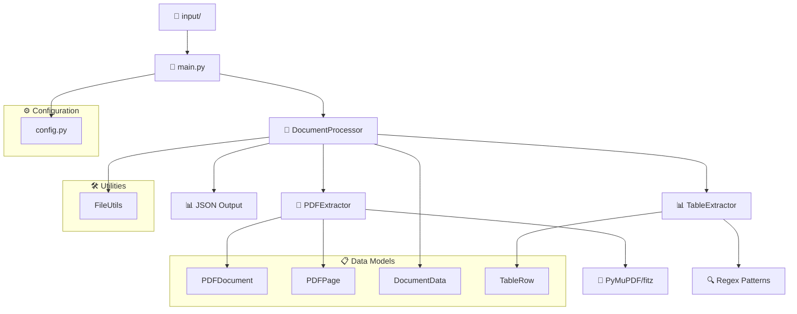
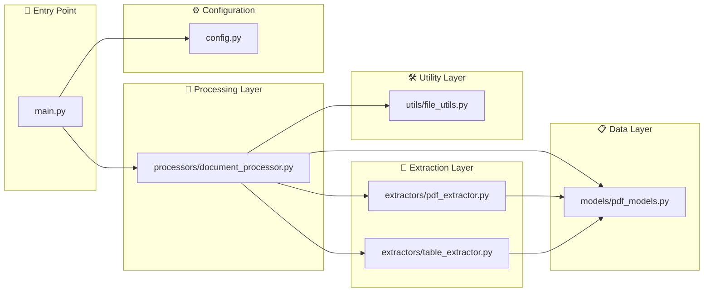
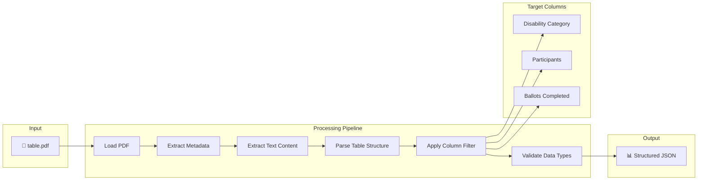
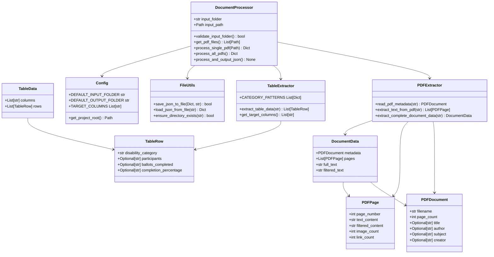
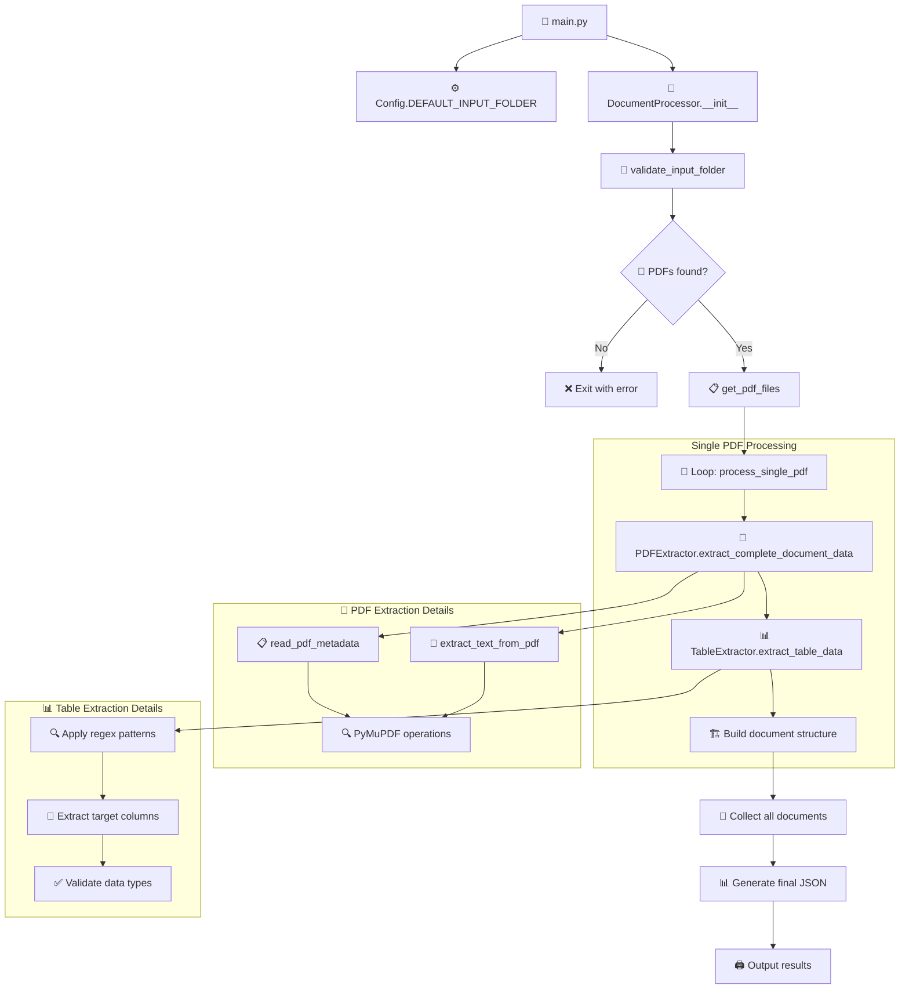
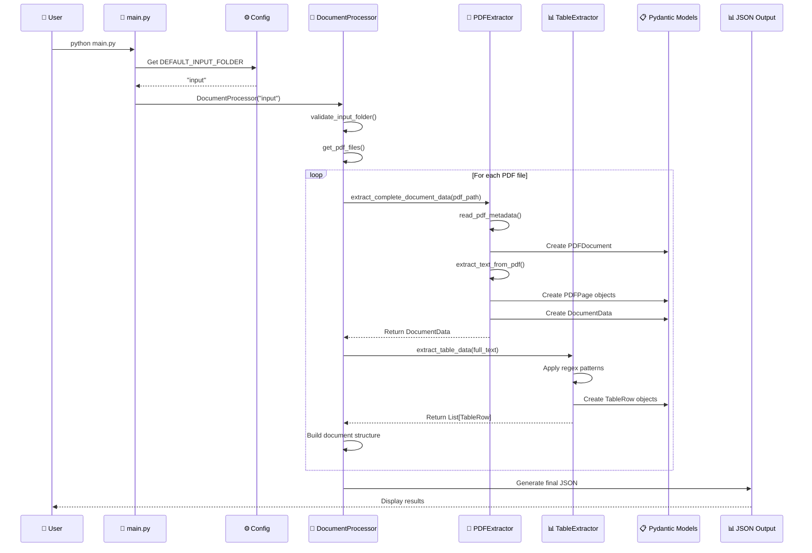
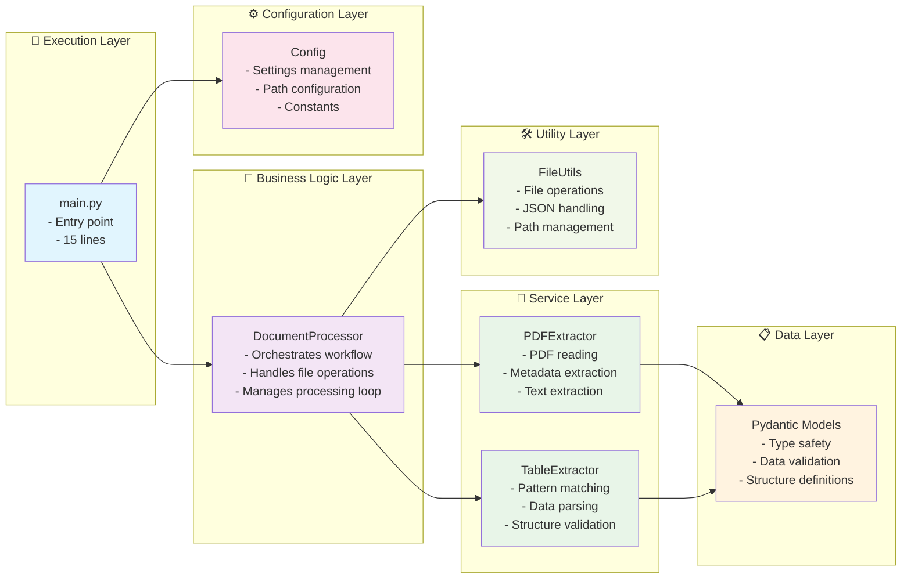
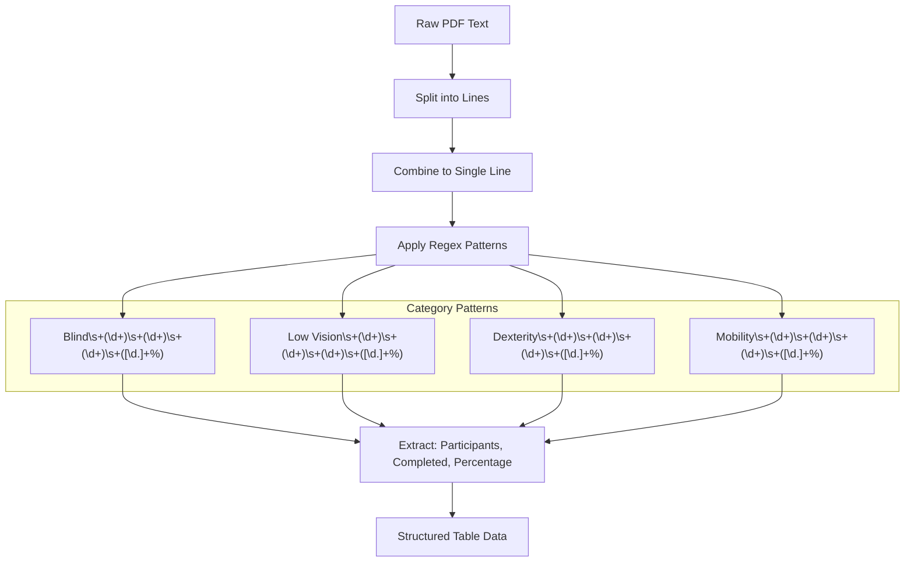
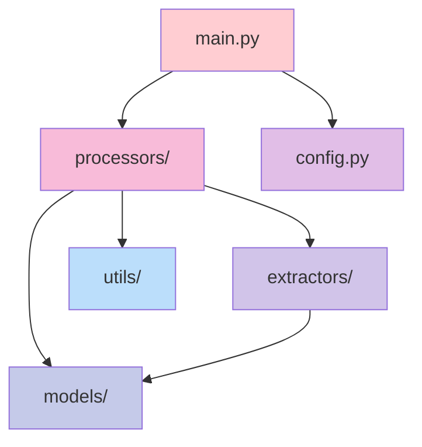

# Fitz Lab - PDF Document Analysis Tool

A Python application that extracts and analyzes table data from PDF documents using PyMuPDF (fitz), with structured data validation using Pydantic.

## 🚀 Features

- Extract metadata from PDF documents
- Parse table data from PDFs with specific column filtering
- Structured JSON output with data validation
- Support for disability category analysis
- Clean, type-safe data models using Pydantic

## 📋 Requirements

See `requirements.txt` for all dependencies:
- `pydantic>=2.0.0` - Data validation and settings management
- `PyMuPDF>=1.23.0` - PDF manipulation (provides fitz module)
- `deepeval>=0.21.0` - LLM evaluation and testing

## 🏗️ Architecture & Code Flow (main.py - Modular Version)

### System Architecture Overview



### Modular Component Interaction



### Data Flow Diagram



### Modular Class Architecture



### Processing Pipeline Architecture



## 🔄 Modular Function Flow

### Main Execution Sequence



### Module Interaction Flow



### Table Data Extraction Process



## 📁 Project Structure

### **Modular Version (Recommended):**
```
fitz-lab/
├── README.md                        # This documentation
├── requirements.txt                 # Python dependencies
├── config.py                        # Configuration settings
├── main.py                         # 🎯 Entry point (modular)
├── models/
│   ├── __init__.py
│   └── pdf_models.py               # 📋 Pydantic data models
├── extractors/
│   ├── __init__.py
│   ├── pdf_extractor.py            # 📄 PDF reading utilities
│   └── table_extractor.py          # 📊 Table parsing logic
├── processors/
│   ├── __init__.py
│   └── document_processor.py       # 🔄 Main orchestration
├── utils/
│   ├── __init__.py
│   └── file_utils.py               # 🛠️ File operations
└── input/                          # PDF files directory
    └── table.pdf                   # Sample data
```

### **Original Version (For Comparison):**
```
├── sampleFitz.py                   # 📄 Original monolithic script (271 lines)
```

## 🚀 Usage

### **Two Versions Available:**

#### **🔹 Version 1: Modular Structure (Recommended)**
```bash
# Clean, maintainable, production-ready
python main.py
```

#### **🔹 Version 2: Original Monolithic**
```bash
# Original single-file version for comparison
python sampleFitz.py
```

### **Setup Instructions:**

1. **Set up environment:**
```bash
# Activate virtual environment
source .venv/bin/activate

# Install dependencies
pip install -r requirements.txt
```

2. **Run either version:**
```bash
# 🎯 Recommended: Modular architecture (main.py)
python main.py

# 📄 Alternative: Original monolithic version
python sampleFitz.py
```

### **🏗️ Modular Architecture Usage**

The `main.py` version demonstrates clean architecture principles:

```python
# 🎯 main.py - Clean entry point
from processors.document_processor import DocumentProcessor
from config import Config

def main():
    processor = DocumentProcessor(Config.DEFAULT_INPUT_FOLDER)
    processor.process_and_output_json()

if __name__ == "__main__":
    main()
```

**Key Architectural Features:**
- ✅ **Single Responsibility**: Each module has one job
- ✅ **Dependency Injection**: Configurable components  
- ✅ **Type Safety**: Pydantic model validation
- ✅ **Testability**: Isolated, mockable components
- ✅ **Extensibility**: Easy to add new features

3. **Expected Output:**
```json
{
  "processed_documents": 1,
  "documents": [
    {
      "filename": "table.pdf",
      "table_data": {
        "columns": ["Disability Category", "Participants", "Ballots Completed"],
        "rows": [
          {
            "disability_category": "Blind",
            "participants": "5",
            "ballots_completed": "1",
            "completion_percentage": "34.5%"
          }
          // ... more categories
        ]
      }
    }
  ]
}
```

## 🏛️ Modular Architecture Benefits

### **🎯 Separation of Concerns**

| Module | Responsibility | Lines | Purpose |
|--------|---------------|--------|---------|
| **`main.py`** | Entry point | ~15 | Application bootstrap |
| **`config.py`** | Configuration | ~35 | Settings management |
| **`models/pdf_models.py`** | Data structures | ~45 | Type safety & validation |
| **`extractors/pdf_extractor.py`** | PDF operations | ~85 | Document reading |
| **`extractors/table_extractor.py`** | Pattern matching | ~75 | Data parsing |
| **`processors/document_processor.py`** | Orchestration | ~95 | Business logic |
| **`utils/file_utils.py`** | File operations | ~55 | Utility functions |

### **🔧 Module Dependencies**



## 📊 Data Model Details

### **Pydantic Models Structure**

The modular application uses strongly-typed Pydantic models:

- **`PDFDocument`**: Stores PDF metadata (author, title, page count)
- **`PDFPage`**: Represents individual page content and statistics  
- **`DocumentData`**: Complete document structure with all pages
- **`TableRow`**: Individual table row with disability data
- **`TableData`**: Complete table structure with columns and rows

### **Type Safety Benefits**

```python
# ✅ Type-safe operations
document: PDFDocument = PDFExtractor.read_pdf_metadata(path)
pages: List[PDFPage] = PDFExtractor.extract_text_from_pdf(path)
table_data: List[TableRow] = TableExtractor.extract_table_data(text)

# ✅ Automatic validation
row = TableRow(
    disability_category="Blind",
    participants="5",
    ballots_completed="1"
)  # Validates data types automatically
```

## 🎯 Key Features Explained

### Column Filtering
The system specifically extracts three columns from PDF tables:
1. **Disability Category** (Blind, Low Vision, Dexterity, Mobility)
2. **Participants** (Total number in each category)
3. **Ballots Completed** (Successfully completed ballots)

### Pattern Matching
Uses regex patterns to identify and extract structured data from unformatted PDF text, handling variations in spacing and formatting.

### Type Safety
All data structures use Pydantic models ensuring type safety and automatic validation of extracted data.

## 🔄 Version Comparison

| Feature | `main.py` (Modular) | `sampleFitz.py` (Original) |
|---------|-------------------|---------------------------|
| **Lines of Code** | ~15 (main) + modules | ~271 (single file) |
| **Structure** | Separated concerns | Mixed responsibilities |
| **Maintainability** | ✅ High | ⚠️ Medium |
| **Testability** | ✅ Easy to unit test | ❌ Hard to test parts |
| **Readability** | ✅ Clear modules | ⚠️ Large single file |
| **Extensibility** | ✅ Easy to add features | ❌ Requires modification |
| **Configuration** | ✅ Centralized in `config.py` | ❌ Hardcoded values |

### **When to Use Which Version:**

- **🎯 Use `main.py`** for:
  - Production environments
  - When adding new features
  - Team collaboration
  - Long-term maintenance

- **📚 Use `sampleFitz.py`** for:
  - Learning/educational purposes
  - Quick prototyping
  - Understanding the full flow in one file
  - Comparing architectural approaches

## 🧪 Testing Both Versions

```bash
# Test modular version
echo "Testing modular version..."
python main.py

echo -e "\n" + "="*50 + "\n"

# Test original version
echo "Testing original version..."
python sampleFitz.py
```

Both versions produce identical output, demonstrating that refactoring improved code organization without changing functionality.

---

**Author:** Mary  
**Created with:** Python 3.12.2, PyMuPDF, Pydantic  
**Architecture:** Available in both monolithic and modular versions
